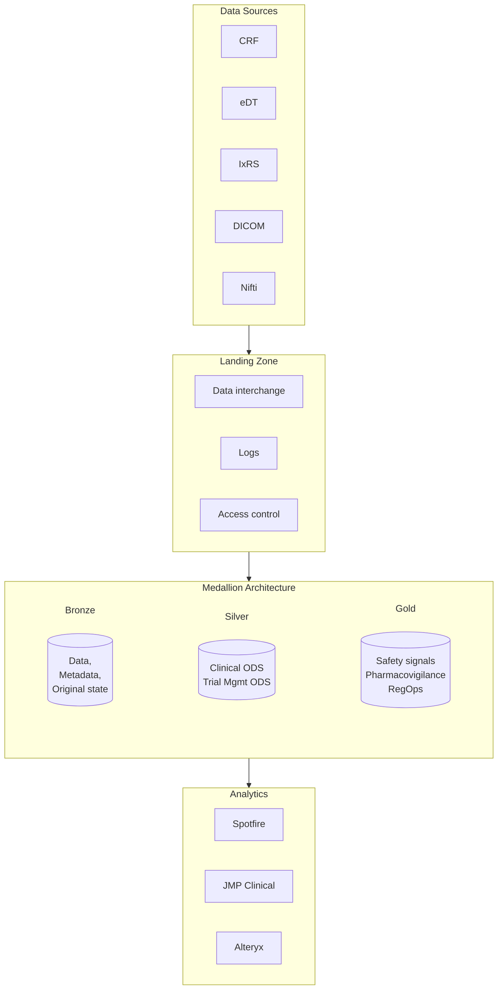

```mermaid
flowchart TD
    subgraph ds[Data Sources]
        ds-n01[CRF]
        ds-n02[eDT]
        ds-n03[IxRS]
        ds-n04[DICOM]
        ds-n05[Nifti]
    end

    subgraph lz[Landing Zone]
        lz-n01[Data interchange]
        lz-n02[Logs]
        lz-n03[Access control]
    end

    subgraph arch[Medallion Architecture]
        direction LR
        subgraph arch-g01[Bronze]
            arch-n01[("`Data,
            Metadata,
            Original state`")]
        end

        subgraph arch-g02[Silver]
            arch-n02[("`Clinical ODS
            Trial Mgmt ODS`")]
        end

        subgraph arch-g03[Gold]
            arch-n03[("`Safety signals
            Pharmacovigilance
            RegOps`")]
        end
    end

    style arch-g01 stroke-width:0px
    style arch-g02 stroke-width:0px
    style arch-g03 stroke-width:0px

    arch-g01 ~~~ arch-g02
    arch-g02 ~~~ arch-g03

    subgraph da[Analytics]
        da-n01[Spotfire]
        da-n02[JMP Clinical]
        da-n03[Alteryx]
    end

    ds --> lz
    lz --> arch
    arch --> da
```