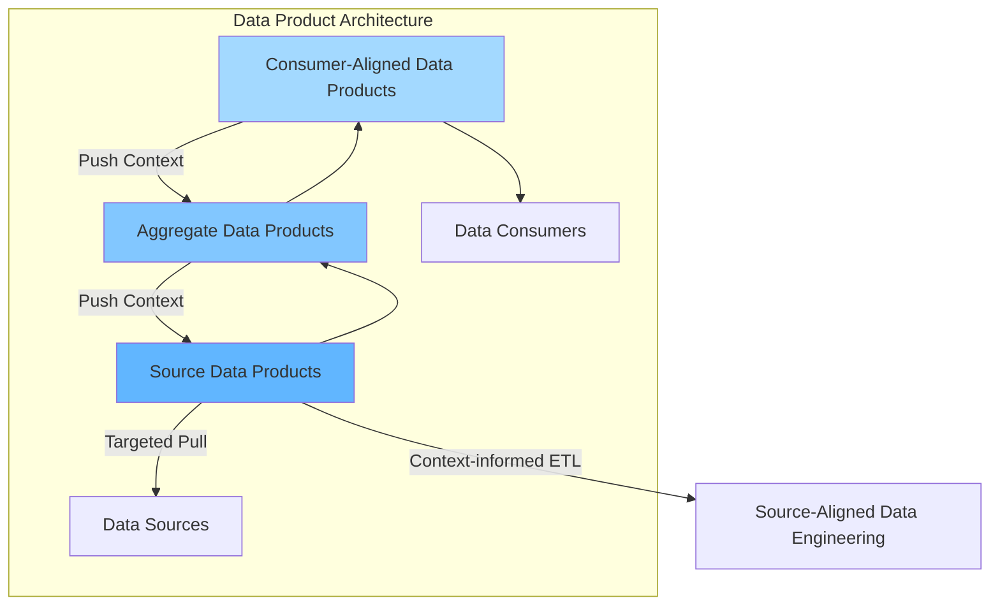

```mermaid
graph TD

subgraph Data Product Architecture
  E1[Consumer-Aligned Data Products] -->|Push Context| E2[Aggregate Data Products]
  E2 -->|Push Context| E3[Source Data Products]
  E3 -->|Targeted Pull| DS[Data Sources]
  E3 --> E2
  E2 --> E1
  E1 --> DC[Data Consumers]
end

style E1 fill:#a3d9ff
style E2 fill:#82c7ff
style E3 fill:#61b6ff

%% Links

%% Data Products architecture
E3 -->|Context-informed ETL| SourcesAligned[Source-Aligned Data Engineering]

```