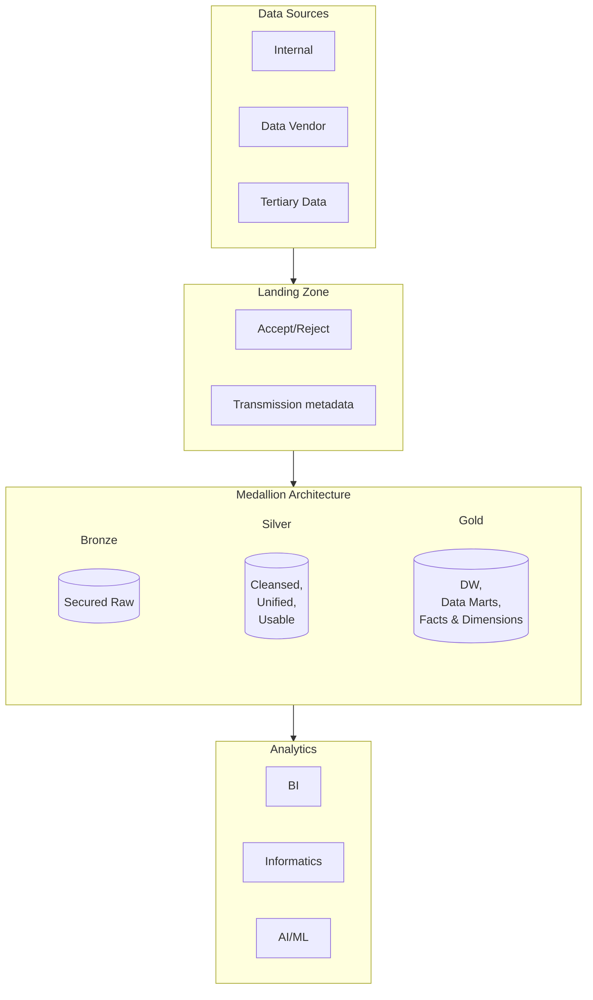

```mermaid
flowchart TD
    subgraph ds[Data Sources]
        ds-n01[Internal]
        ds-n02[Data Vendor]
        ds-n03[Tertiary Data]
    end

    subgraph lz[Landing Zone]
        lz-n01[Accept/Reject]
        lz-n02[Transmission metadata]
    end

    subgraph arch[Medallion Architecture]
        direction LR
        subgraph arch-g01[Bronze]
            arch-n01[(Secured Raw)]
        end

        subgraph arch-g02[Silver]
            arch-n02[("`Cleansed,
            Unified,
            Usable`")]
        end

        subgraph arch-g03[Gold]
            arch-n03[("`DW,
            Data Marts,
            Facts & Dimensions`")]
        end
    end

    style arch-g01 stroke-width:0px
    style arch-g02 stroke-width:0px
    style arch-g03 stroke-width:0px

    arch-g01 ~~~ arch-g02
    arch-g02 ~~~ arch-g03

    subgraph da[Analytics]
        da-n01[BI]
        da-n02[Informatics]
        da-n03[AI/ML]
    end

    ds --> lz
    lz --> arch
    arch --> da
```