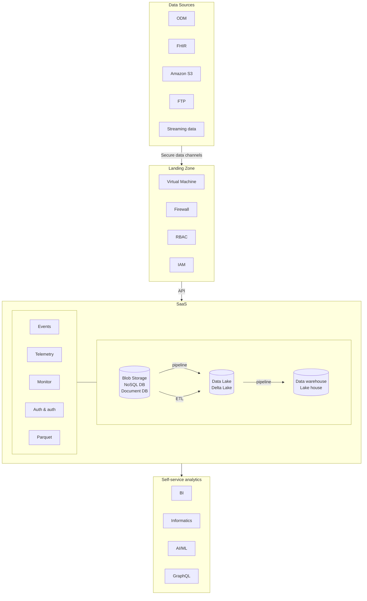

```mermaid
flowchart TD
    subgraph ds[Data Sources]
        ds-n01[ODM]
        ds-n02[FHIR]
        ds-n03[Amazon S3]
        ds-n04[FTP]
        ds-n05[Streaming data]
    end

    subgraph lz[Landing Zone]
        lz-n01[Virtual Machine]
        lz-n02[Firewall]
        lz-n03[RBAC]
        lz-n04[IAM]
    end

    subgraph arch[SaaS]
        direction LR
        subgraph stages[ ]
            direction LR
            subgraph arch-g01[ ]
                arch-n01[("`Blob Storage
                NoSQL DB
                Document DB`")]
            end

            subgraph arch-g02[ ]
                arch-n02[("`Data Lake
                Delta Lake`")]
            end

            subgraph arch-g03[ ]
                arch-n03[("`Data warehouse
                Lake house`")]
            end
        end

        subgraph components[ ]
            direction LR
            com-n01[Events]
            com-n02[Telemetry]
            com-n03[Monitor]
            com-n04[Auth & auth]
            com-n05[Parquet]
        end
    end

    style arch-g01 stroke-width:0px
    style arch-g02 stroke-width:0px
    style arch-g03 stroke-width:0px

    arch-g01 -- pipeline --> arch-g02
    arch-g01 -- ETL --> arch-g02
    arch-g02 -- pipeline --> arch-g03

    components --- stages 

    subgraph da[Self-service analytics]
        da-n01[BI]
        da-n02[Informatics]
        da-n03[AI/ML]
        da-n04[GraphQL]
    end

    ds -- Secure data channels --> lz
    lz -- API --> arch
    arch --> da
```