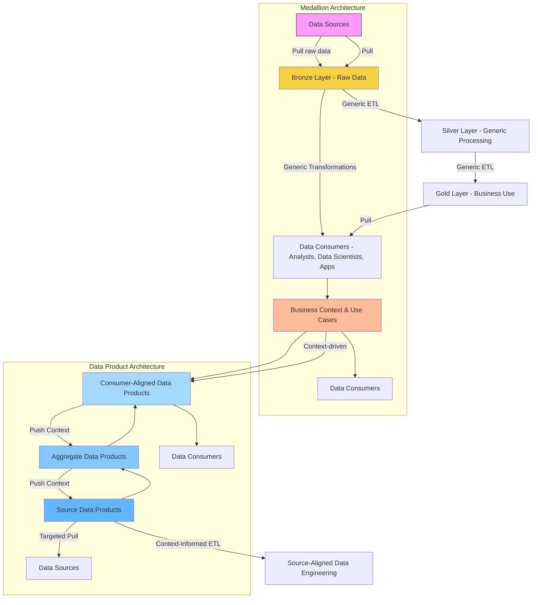

```mermaid
graph TD

subgraph Medallion Architecture
  A[Data Sources] -->|Pull raw data| B[Bronze Layer - Raw Data]
  B -->|Generic Transformations| C[Silver Layer - Cleansed & Conformed]
  C --> D[Gold Layer - Generic Aggregates]
  D --> E[Data Consumers]
end

subgraph Data Product Architecture
  D[Business Context & Use Cases] --> E1[Consumer-Aligned Data Products]
  E1 -->|Push Context| E2[Aggregate Data Products]
  E2 -->|Push Context| E3[Source Data Products]
  E3 -->|Targeted Pull| DS[Data Sources]
  E3 --> E2
  E2 --> E1
  E1 --> DC[Data Consumers]
end

style A fill:#f9f,stroke:#333,stroke-width:1px
style B fill:#f5d142
style E1 fill:#a3d9ff
style E2 fill:#82c7ff
style E3 fill:#61b6ff
style D fill:#ffbb99

%% Links
A -->|Pull| B
B -->|Generic ETL| Silver[Silver Layer - Generic Processing]
Silver -->|Generic ETL| Gold[Gold Layer - Generic Aggregates]
Gold[Gold Layer - Business Use] -->|Pull| C[Data Consumers - Analysts, Data Scientists, Apps]

%% Data Products architecture
D -->|Context-driven| E1
E3 -->|Context-informed ETL| SourcesAligned[Source-Aligned Data Engineering]
```